<!-- markdownlint-disable MD022 MD024 MD032 MD033 -->
# Code Notes

This site contains code notes for project 3 of my Udacity React Nanodegree project. Click the link below for more information on the course.
- [Udacity's React Nanodegree Program](https://www.udacity.com/course/react-nanodegree--nd019)

[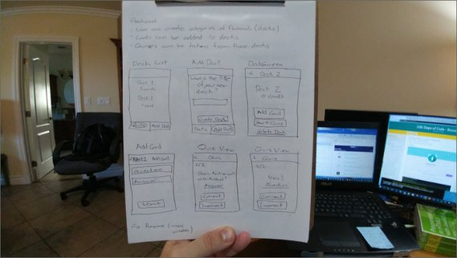](assets/images/mfc2.jpg)<br>
<span class="center bold">App Mockup</span>

---

## 1. Project Requirements
### 1.1 Overview
The assignment is to build a mobile flashcard app from scratch using React Native.

There is no starter code and below is the link to the rubric.

- [Mobile Flashcard Project Specification](https://review.udacity.com/#!/rubrics/1021/view)

### 1.2 Specific Requirements
Here are the high-level requirements for this app.

- Use [expo-cli](https://docs.expo.io/versions/v32.0.0/introduction/installation/) to build the project.
- Allow users to create a deck which can hold an unlimited number of cards.
- Allow users to add a card to a specific deck.
- The front of the card should display the question.
- The back of the card should display the answer.
- Users should be able to quiz themselves on a specific deck and receive a score once they're done.
- Users should receive a notification to remind themselves to study if they haven't already for that day.

### 1.3 Views
The application should have five views. The Quiz View should change based on the data.

[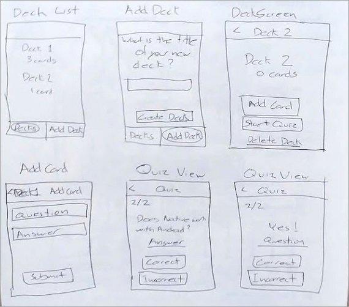](assets/images/mfc1.jpg)<br>
<span class="center bold">Views</span>

Here are the views needed for this app.

1. DeckList
2. AddDeck
3. Deck (Individual)
4. AddCard
5. Quiz
   - Front (Question)
   - Back (Answer)
   - Results (Upon completion)

#### 1.3.1 DeckList View (Default)

- displays the title of each Deck
- displays the number of cards in each deck

#### 1.3.2 AddDeck View

- An option to enter in the title for the new deck
- An option to submit the new deck title

#### 1.3.3 Deck View

- displays the title of the Deck
- displays the number of cards in the deck
- displays an option to start a quiz on this specific deck
- An option to add a new question to the deck

#### 1.3.4 AddCard View

- An option to enter in the question
- An option to enter in the answer
- An option to submit the new question

#### 1.3.5 Quiz View

- displays a card question
- an option to view the answer (flips the card)
- a "Correct" button
- an "Incorrect" button
- the number of cards left in the quiz
- Displays the percentage correct once the quiz is complete

### 1.4 Data
We'll use Expo's `AsyncStorage` to store our decks and flashcards. Redux is optional for this project but we'll use it nonetheless.

Using AsyncStorage we'll manage an object whose shape is similar to this:

```js
{
  React: {
    title: 'React',
    questions: [
      {
        question: 'What is React?',
        answer: 'A library for managing user interfaces'
      },
      {
        question: 'Where do you make Ajax requests in React?',
        answer: 'The componentDidMount lifecycle event'
      }
    ]
  },
  JavaScript: {
    title: 'JavaScript',
    questions: [
      {
        question: 'What is a closure?',
        answer: 'The combination of a function and the lexical environment
          within which that function was declared.'
      }
    ]
  }
}
```

Effects of app on the data.

- Each deck creates a new key on the object.
- Each deck has a `title` and a `questions` key.
- `title` is the title for the specific deck
- `questions` is an array of questions and answers for that deck.

### 1.5 Helper Methods
To manage your AsyncStorage database, you'll want to create four different helper methods.

- `getDecks`: return all of the decks along with their titles, questions, and answers.
- `getDeck`: take in a single id argument and return the deck associated with that id.
- `saveDeckTitle`: take in a single title argument and add it to the decks.
- `addCardToDeck`: take in two arguments, title and card, and will add the card to the list of questions for the deck with the associated title.

#### 1.5.1 UI to Test API Methods
I created the API methods and a UI to test with.

[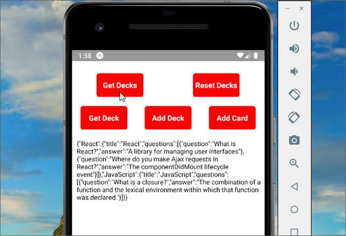](assets/images/mfc3.jpg)<br>
<span class="center bold">API Tests</span>

The methods are located in 'utils/api.js'

```js
import { AsyncStorage } from 'react-native';
import { decks } from './_DATA';

const DECKS_STORAGE_KEY = 'MobileFlashcards:decks';

export async function getDecks() {
  try {
    const storeResults = await AsyncStorage.getItem(DECKS_STORAGE_KEY);

    if (storeResults === null) {
      AsyncStorage.setItem(DECKS_STORAGE_KEY, JSON.stringify(decks));
    }

    return storeResults === null ? decks : JSON.parse(storeResults);
  } catch (err) {
    console.log(err);
  }
}

export async function getDeck(id) {
  try {
    const storeResults = await AsyncStorage.getItem(DECKS_STORAGE_KEY);

    return JSON.parse(storeResults)[id];
  } catch (err) {
    console.log(err);
  }
}

export async function saveDeckTitle(title) {
  try {
    await AsyncStorage.mergeItem(
      DECKS_STORAGE_KEY,
      JSON.stringify({
        [title]: {
          title,
          questions: []
        }
      })
    );
  } catch (err) {
    console.log(err);
  }
}

export async function removeDeck(key) {
  try {
    const results = await AsyncStorage.getItem(DECKS_STORAGE_KEY);
    const data = JSON.parse(results);
    data[key] = undefined;
    delete data[key];
    AsyncStorage.setItem(DECKS_STORAGE_KEY, JSON.stringify(data));
  } catch (err) {
    console.log(err);
  }
}

export async function addCardToDeck(title, card) {
  try {
    const deck = await getDeck(title);

    await AsyncStorage.mergeItem(
      DECKS_STORAGE_KEY,
      JSON.stringify({
        [title]: {
          questions: [...deck.questions].concat(card)
        }
      })
    );
  } catch (err) {
    console.log(err);
  }
}

export async function resetDecks() {
  try {
    await AsyncStorage.removeItem(DECKS_STORAGE_KEY);
  } catch (err) {
    console.log(err);
  }
}
```

The methods can then be tested by clicking each button.

[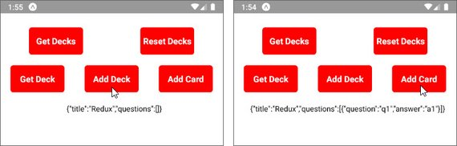](assets/images/mfc4.jpg)<br>
<span class="center bold">API Tests</span>

## 2. Views
Here are screenshots of the initial views.

### 2.1 DeckList

[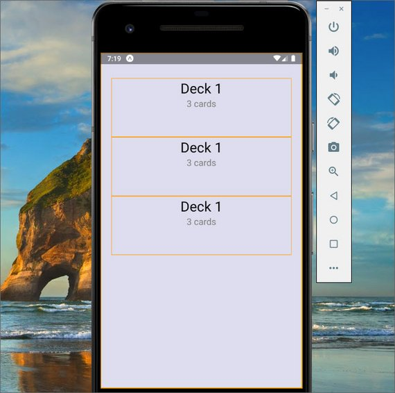](assets/images/mfc5.jpg)<br>
<span class="center bold">DeckList View</span>

This view contains multiple instances of the Deck component.

### 2.2 AddDeck

[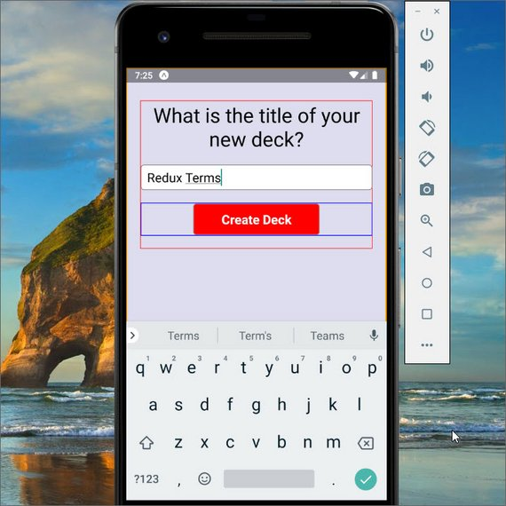](assets/images/mfc6.jpg)<br>
<span class="center bold">AddDeck View</span>

### 2.3 DeckDetail

[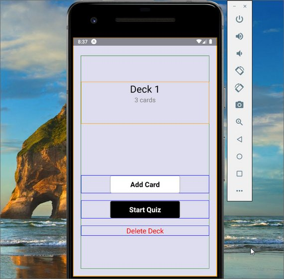](assets/images/mfc7.jpg)<br>
<span class="center bold">DeckDetail View</span>

### 2.4 AddCard

[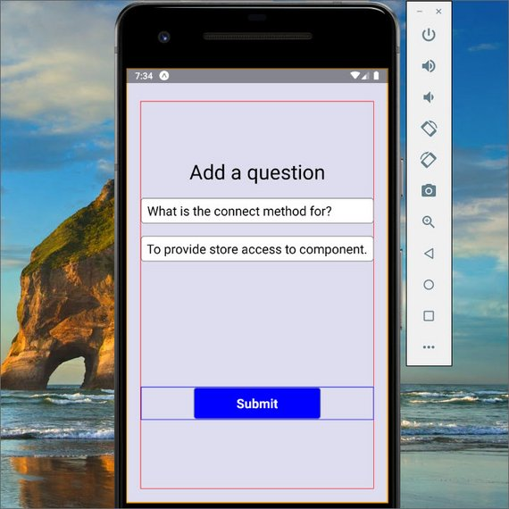](assets/images/mfc8.jpg)<br>
<span class="center bold">AddCard View</span>

### 2.5 Quiz

[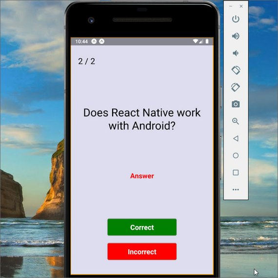](assets/images/mfc9.jpg)<br>
<span class="center bold">Quiz View - Question</span>

[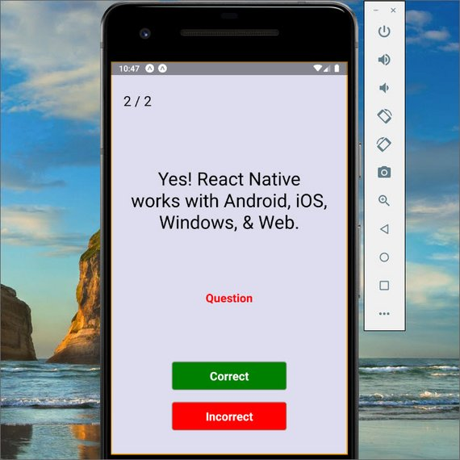](assets/images/mfc10.jpg)<br>
<span class="center bold">Quiz View - Answer</span>

[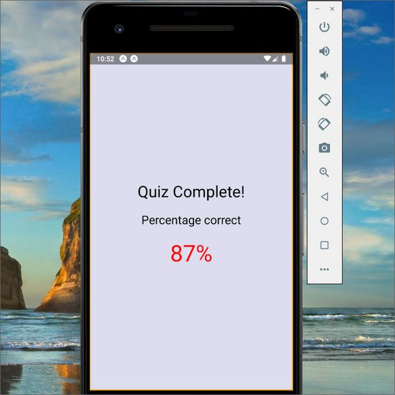](assets/images/mfc11.jpg)<br>
<span class="center bold">Quiz View - Results</span>

## 3. Navigation
### 3.1 Decks Tab

[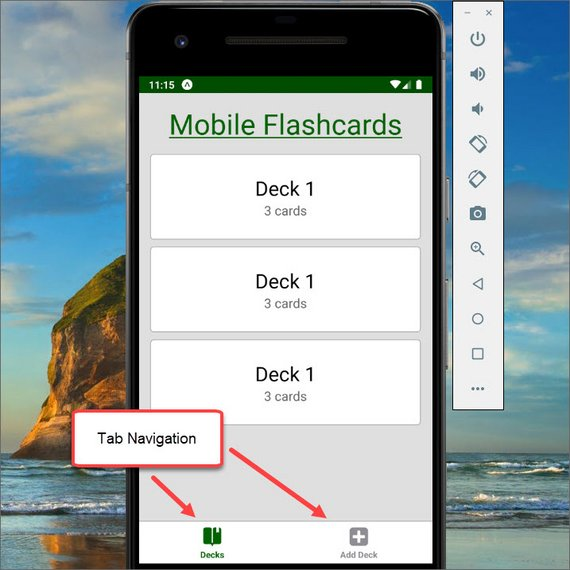](assets/images/mfc12.jpg)<br>
<span class="center bold">Tab Navigator - DeckList</span>

### 3.2 Add Deck Tab

[](assets/images/mfc15.jpg)<br>
<span class="center bold">Tab Navigator - AddDeck</span>

### 3.3 Deck Details Navigator

[](assets/images/mfc13.jpg)<br>
<span class="center bold">Stack Navigator - DeckDetails</span>

### 3.4 AddCard Navigator

[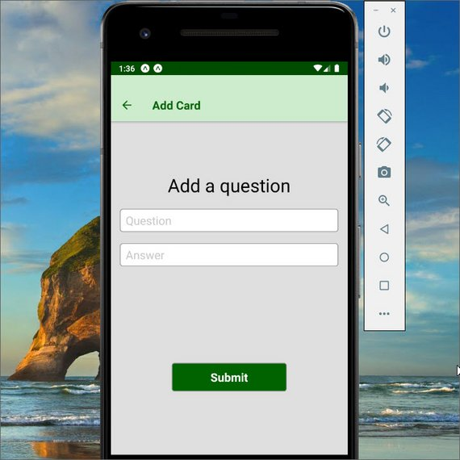](assets/images/mfc14.jpg)<br>
<span class="center bold">Stack Navigator - AddCard</span>

### 3.5 Quiz Navigator

[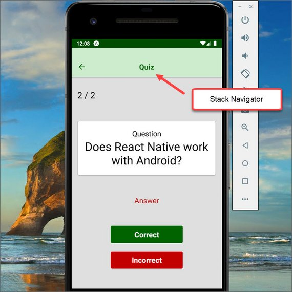](assets/images/mfc16.jpg)<br>
<span class="center bold">Stack Navigator - Quiz Question</span>

[](assets/images/mfc17.jpg)<br>
<span class="center bold">Stack Navigator - Quiz Answer</span>

[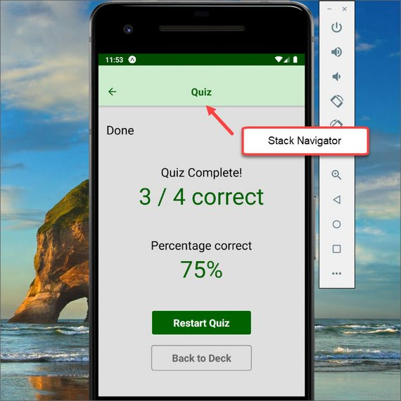](assets/images/mfc19.jpg)<br>
<span class="center bold">Stack Navigator - Quiz Passing</span>

[](assets/images/mfc18.jpg)<br>
<span class="center bold">Stack Navigator - Quiz Failing</span>

### 3.6 Code
The code is split into 3 parts.

- MainTabNavigator - contains tab navigator & stack navigator code
- AppNavigator.js - wrapper for MainTabNavigator
- App.js - Entry point

#### 3.6.1 MainTabNavigator.js

```jsx
// MainTabNavigator.js
import React from 'react';
import PropTypes from 'prop-types';
import { Platform } from 'react-native';
import { Icon } from 'expo';
import {
  createBottomTabNavigator,
  createStackNavigator
} from 'react-navigation';
import DeckList from '../components/DeckList';
import AddDeck from '../components/AddDeck';
import DeckDetail from '../components/DeckDetail';
import AddCard from '../components/AddCard';
import Quiz from '../components/Quiz';
import Settings from '../components/Settings';

import { darkGray, white, green, lightGreen } from '../utils/colors';

const isIOS = Platform.OS === 'ios' ? true : false;

const routeConfigs = {
  Decks: {
    screen: DeckList,
    navigationOptions: {
      tabBarLabel: 'Decks',
      tabBarIcon: ({ tintColor }) => (
        <Icon.Ionicons
          name={isIOS ? 'ios-bookmarks' : 'md-bookmarks'}
          size={30}
          color={tintColor}
        />
      )
    }
  },
  AddDeck: {
    screen: AddDeck,
    navigationOptions: {
      tabBarLabel: 'Add Deck',
      tabBarIcon: ({ tintColor }) => (
        <Icon.FontAwesome name="plus-square" size={30} color={tintColor} />
      )
    }
  },
  Settings: {
    screen: Settings,
    navigationOptions: {
      tabBarLabel: 'Settings',
      tabBarIcon: ({ tintColor }) => (
        <Icon.FontAwesome name="sliders" size={30} color={tintColor} />
      )
    }
  }
};

routeConfigs.Decks.navigationOptions.tabBarIcon.propTypes = {
  tintColor: PropTypes.string.isRequired
};
routeConfigs.AddDeck.navigationOptions.tabBarIcon.propTypes = {
  tintColor: PropTypes.string.isRequired
};
routeConfigs.Settings.navigationOptions.tabBarIcon.propTypes = {
  tintColor: PropTypes.string.isRequired
};

const tabNavigatorConfig = {
  navigationOptions: {
    header: null
  },
  defaultNavigationOptions: {
    bounces: true
  },
  tabBarOptions: {
    activeTintColor: green,
    style: {
      height: 60,
      backgroundColor: white,
      shadowColor: 'rgba(0,0,0, 0.24)',
      shadowOffset: {
        width: 0,
        height: 3
      },
      shadowRadius: 6,
      shadowOpacity: 1,
      borderTopWidth: 1,
      borderTopColor: darkGray
    },
    labelStyle: {
      fontSize: 12,
      fontWeight: 'bold'
    },
    tabStyle: {
      marginTop: 5,
      marginBottom: 3
    },
    showIcon: true
  }
};

const Tabs = createBottomTabNavigator(routeConfigs, tabNavigatorConfig);

const MainNavigator = createStackNavigator(
  {
    Home: {
      screen: Tabs
    },
    DeckDetail: {
      screen: DeckDetail,
      navigationOptions: {
        headerTintColor: green,
        headerStyle: {
          backgroundColor: lightGreen
        },
        title: 'Deck Details'
      }
    },
    AddCard: {
      screen: AddCard,
      navigationOptions: {
        headerTintColor: green,
        headerStyle: {
          backgroundColor: lightGreen
        },
        headerTitleStyle: {
          textAlign: 'center',
          justifyContent: 'center',
          textAlign: 'center'
        },
        title: 'Add Card'
      }
    },
    Quiz: {
      screen: Quiz,
      navigationOptions: {
        headerTintColor: green,
        headerStyle: {
          backgroundColor: lightGreen
        }
      }
    }
  },
  { headerLayoutPreset: 'center' }
);

export default MainNavigator;
```

#### 3.6.2 AppNavigator.js

```jsx
// AppNavigator.js
import React from 'react';
import { createAppContainer } from 'react-navigation';
import MainTabNavigator from './MainTabNavigator';

export default createAppContainer(MainTabNavigator);
```

#### 3.6.3 App.js

```jsx
// App.js
import React from 'react';
import PropTypes from 'prop-types';
import { StyleSheet, View, StatusBar } from 'react-native';
import { Constants } from 'expo';
import AppNavigator from './navigation/AppNavigator';

function FlashcardStatusBar({ backgroundColor, ...props }) {
  return (
    <View style={{ backgroundColor, height: Constants.statusBarHeight }}>
      <StatusBar translucent backgroundColor={backgroundColor} {...props} />
    </View>
  );
}
FlashcardStatusBar.propTypes = {
  backgroundColor: PropTypes.string.isRequired
};

export default class App extends React.Component {
  render() {
    return (
      <View style={styles.container}>
        <FlashcardStatusBar
          backgroundColor="green"
          barStyle="light-content"
        />
        <AppNavigator />
      </View>
    );
  }
}

const styles = StyleSheet.create({
  container: {
    flex: 1,
    backgroundColor: '#dde'
  }
});
```

## 4. Redux
The next step was to add in all the redux pieces.

### 4.1 Actions
The actions is in './actions/index.js'.

```js
// index.js
import { getDecks } from '../utils/api';

export const RECEIVE_DECKS = 'RECEIVE_DECKS';
export const ADD_DECK = 'ADD_DECK';
export const REMOVE_DECK = 'REMOVE_DECK';
export const ADD_CARD = 'ADD_CARD';

export function receiveDecks(decks) {
  return {
    type: RECEIVE_DECKS,
    decks
  };
}

export function addDeck(title) {
  return {
    type: ADD_DECK,
    title
  };
}

export function removeDeck(id) {
  return {
    type: REMOVE_DECK,
    id
  };
}

export function addCardToDeck(id, card) {
  return {
    type: ADD_CARD,
    deckId,
    card
  };
}

export function handleInitialData() {
  return dispatch => {
    return getDecks().then(decks => {
      dispatch(receiveDecks(decks));
    });
  };
}
```

### 4.2 Reducers
This is in './reducers/index.js'.

```js
// index.js
import {
  RECEIVE_DECKS,
  ADD_DECK,
  REMOVE_DECK,
  ADD_CARD
} from '../actions/index';
// import { decks as INITIAL_STATE } from '../utils/_DATA';

export default function decks(state = {}, action) {
  switch (action.type) {
    case RECEIVE_DECKS:
      return {
        ...state,
        ...action.decks
      };
    case ADD_DECK:
      const { title } = action;
      return {
        ...state,
        [title]: {
          title,
          questions: []
        }
      };
    case REMOVE_DECK:
      const { id } = action;
      // return ({ [id]: value, ...remainingDecks } = state);
      const { [id]: value, ...remainingDecks } = state;
      console.log(remainingDecks);
      return remainingDecks;
    case ADD_CARD:
      const { deckId, card } = action;
      return {
        ...state,
        [deckId]: {
          ...state[deckId],
          questions: [...state[deckId].questions].concat(card)
        }
      };
    default:
      return state;
  }
}
```

### 4.3 Store Provider
The next step was to add the Provider code to './App.js'.

```jsx
// App.js
import React from 'react';
import PropTypes from 'prop-types';
import { StyleSheet, View, StatusBar } from 'react-native';
import { createStore, applyMiddleware } from 'redux';
import thunk from 'redux-thunk';
import logger from 'redux-logger';
import { Provider } from 'react-redux';
import reducer from './reducers/index';
import { Constants } from 'expo';
import AppNavigator from './navigation/AppNavigator';

const store = createStore(
  reducer,
  applyMiddleware(thunk, logger)
);

function FlashcardStatusBar({ backgroundColor, ...props }) {
  return (
    <View style={{ backgroundColor, height: Constants.statusBarHeight }}>
      <StatusBar translucent backgroundColor={backgroundColor} {...props} />
    </View>
  );
}
FlashcardStatusBar.propTypes = {
  backgroundColor: PropTypes.string.isRequired
};

export default class App extends React.Component {
  render() {
    return (
      <Provider store={store}>
        <View style={styles.container}>
          <FlashcardStatusBar
            backgroundColor="green"
            barStyle="light-content"
          />
          <AppNavigator />
        </View>
      </Provider>
    );
  }
}

const styles = StyleSheet.create({
  container: {
    flex: 1,
    backgroundColor: '#dde'
  }
});
```

### 4.4 Entry Point
Now we can connect Redux up to our initial component. This is in './components/DeckList.js'.

[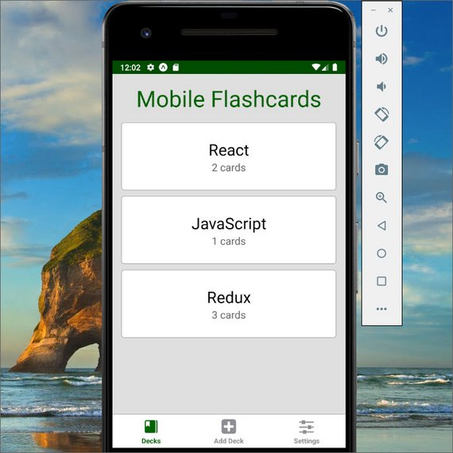](assets/images/mfc21.jpg)<br>
<span class="center bold">Updated Home Screen</span>

#### 4.4.1 DeckList Component

```jsx
// DeckList.js
import React, { Component } from 'react';
import PropTypes from 'prop-types';
import {
  ScrollView,
  View,
  Text,
  StyleSheet,
  TouchableOpacity
} from 'react-native';
import { connect } from 'react-redux';
import Deck from './Deck';
import { gray, green } from '../utils/colors';
import { handleInitialData } from '../actions/index';

export class DeckList extends Component {
  static propTypes = {
    navigation: PropTypes.object.isRequired,
    handleInitialData: PropTypes.func.isRequired,
    decks: PropTypes.object.isRequired
  };
  componentDidMount() {
    this.props.handleInitialData();
  }
  render() {
    const { decks, navigation } = this.props;

    return (
      <ScrollView style={styles.container}>
        <Text style={styles.title}>Mobile Flashcards</Text>
        {Object.values(decks).map(deck => {
          return (
            <TouchableOpacity
              key={deck.title}
              onPress={() =>
                navigation.navigate('DeckDetail', { title: deck.title })
              }
            >
              <Deck id={deck.title} />
            </TouchableOpacity>
          );
        })}
        <View style={{ marginBottom: 30 }} />
      </ScrollView>
    );
  }
}

const styles = StyleSheet.create({
  container: {
    flex: 1,
    paddingTop: 16,
    paddingLeft: 16,
    paddingRight: 16,
    paddingBottom: 16,
    backgroundColor: gray
  },
  title: {
    fontSize: 40,
    textAlign: 'center',
    marginBottom: 16,
    color: green
  }
});

const mapStateToProps = state => ({ decks: state });

export default connect(
  mapStateToProps,
  { handleInitialData }
)(DeckList);
```

#### 4.4.2 Deck Component
The Decks component is located in './components/Deck.js'. It looks like this.

```jsx
// Deck.js
import React from 'react';
import PropTypes from 'prop-types';
import { View, Text, StyleSheet } from 'react-native';
import { white, textGray } from '../utils/colors';
import { connect } from 'react-redux';

const Deck = props => {
  const { deck } = props;

  if (deck === undefined) {
    return <View style={styles.deckContainer} />;
  }
  return (
    <View style={styles.deckContainer}>
      <View>
        <Text style={styles.deckText}>{deck.title}</Text>
      </View>
      <View>
        <Text style={styles.cardText}>{deck.questions.length} cards</Text>
      </View>
    </View>
  );
};
Deck.propTypes = {
  deck: PropTypes.object
};

const styles = StyleSheet.create({
  deckContainer: {
    alignItems: 'center',
    justifyContent: 'center',
    flexBasis: 120,
    minHeight: 120,
    borderWidth: 1,
    borderColor: '#aaa',
    backgroundColor: white,
    borderRadius: 5,
    marginBottom: 10
  },
  deckText: {
    fontSize: 28
  },
  cardText: {
    fontSize: 18,
    color: textGray
  }
});

const mapStateToProps = (state, { id }) => {
  const deck = state[id];

  return {
    deck
  };
};

export default connect(mapStateToProps)(Deck);

```

## 5. Wire-up Components
### 5.1  Add Deck

[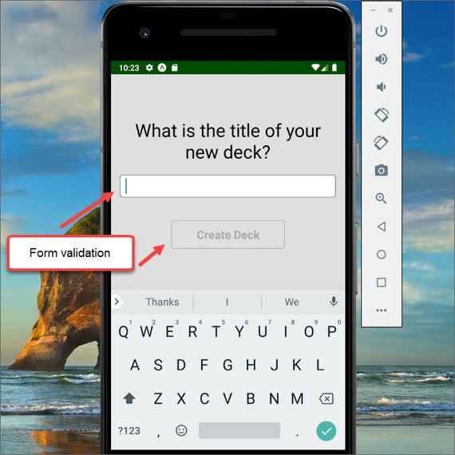](assets/images/mfc24.jpg)<br>
<span class="center bold">Add Deck with disabled submit</span>

[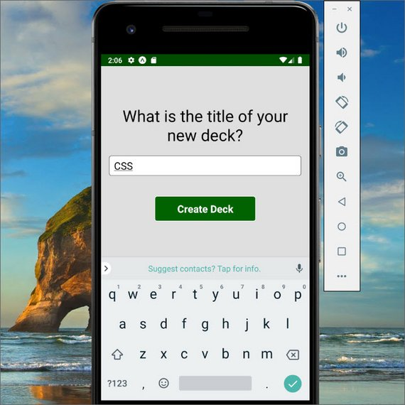](assets/images/mfc22.jpg)<br>
<span class="center bold">Add Deck with validation</span>

```jsx
// AddDeck.js
import React, { Component } from 'react';
import PropTypes from 'prop-types';
import { Text, View, StyleSheet, TextInput } from 'react-native';
import TouchButton from './TouchButton';
import { gray, green, white, textGray } from '../utils/colors';
import { connect } from 'react-redux';
import { addDeck } from '../actions/index';

export class AddDeck extends Component {
  static propTypes = {
    navigation: PropTypes.object.isRequired,
    addDeck: PropTypes.func.isRequired
  };
  state = {
    text: ''
  };
  handleChange = text => {
    this.setState({ text });
  };
  handleSubmit = () => {
    const { addDeck, navigation } = this.props;

    addDeck(this.state.text);
    this.setState(() => ({ text: '' }));
    navigation.goBack();
  };
  render() {
    return (
      <View style={styles.container}>
        <View style={{ height: 60 }} />
        <View style={styles.block}>
          <Text style={styles.title}>What is the title of your new deck?</Text>
        </View>
        <View style={[styles.block]}>
          <TextInput
            style={styles.input}
            value={this.state.text}
            onChangeText={this.handleChange}
          />
        </View>
        <TouchButton
          btnStyle={{ backgroundColor: green, borderColor: white }}
          onPress={this.handleSubmit}
          disabled={this.state.text === ''}
        >
          Create Deck
        </TouchButton>
      </View>
    );
  }
}

const styles = StyleSheet.create({
  container: {
    flex: 1,
    paddingTop: 16,
    paddingLeft: 16,
    paddingRight: 16,
    paddingBottom: 16,
    backgroundColor: gray
  },
  block: {
    marginBottom: 20
  },
  title: {
    textAlign: 'center',
    fontSize: 32
  },
  input: {
    borderWidth: 1,
    borderColor: textGray,
    backgroundColor: white,
    paddingLeft: 10,
    paddingRight: 10,
    borderRadius: 5,
    fontSize: 20,
    height: 40,
    marginBottom: 20
  }
});

export default connect(
  null,
  { addDeck }
)(AddDeck);
```

[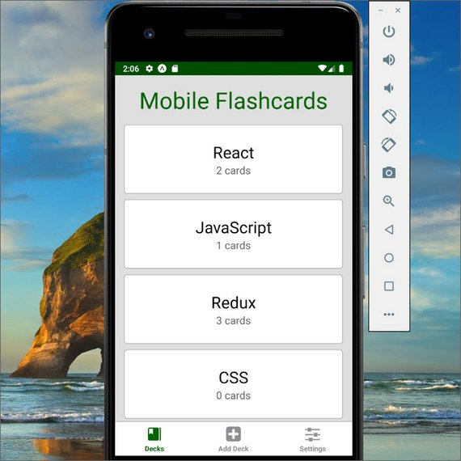](assets/images/mfc23.jpg)<br>
<span class="center bold">Deck Added</span>

### 5.2 Deck Details

```jsx
// DeckDetails.js
import React, { Component } from 'react';
import PropTypes from 'prop-types';
import { View, StyleSheet } from 'react-native';
import Deck from './Deck';
import TouchButton from './TouchButton';
import TextButton from './TextButton';
import { gray, textGray, green, white, red } from '../utils/colors';
import { connect } from 'react-redux';
import { removeDeck } from '../actions/index';

export class DeckDetail extends Component {
  static propTypes = {
    navigation: PropTypes.object.isRequired,
    removeDeck: PropTypes.func.isRequired,
    deck: PropTypes.object
  };
  shouldComponentUpdate(nextProps) {
    return nextProps.deck !== undefined;
  }
  handleDelete = id => {
    this.props.removeDeck(id);
    this.props.navigation.goBack();
  };
  render() {
    const { deck } = this.props;

    return (
      <View style={styles.container}>
        <Deck id={deck.title} />
        <View>
          <TouchButton
            btnStyle={{ backgroundColor: white, borderColor: textGray }}
            txtStyle={{ color: textGray }}
            onPress={() =>
              this.props.navigation.navigate('AddCard', { title: deck.title })
            }
          >
            Add Card
          </TouchButton>
          <TouchButton
            btnStyle={{ backgroundColor: green, borderColor: white }}
            txtStyle={{ color: white }}
            onPress={() =>
              this.props.navigation.navigate('Quiz', { title: deck.title })
            }
          >
            Start Quiz
          </TouchButton>
        </View>
        <TextButton
          txtStyle={{ color: red }}
          onPress={() => this.handleDelete(deck.title)}
        >
          Delete Deck
        </TextButton>
      </View>
    );
  }
}

const styles = StyleSheet.create({
  container: {
    flex: 1,
    justifyContent: 'space-around',
    paddingTop: 16,
    paddingLeft: 16,
    paddingRight: 16,
    paddingBottom: 16,
    backgroundColor: gray
  }
});

const mapStateToProps = (state, { navigation }) => {
  const title = navigation.getParam('title', 'undefined');
  const deck = state[title];

  return {
    deck
  };
};

export default connect(
  mapStateToProps,
  { removeDeck }
)(DeckDetail);
```

### 5.3 Add Card To Deck

[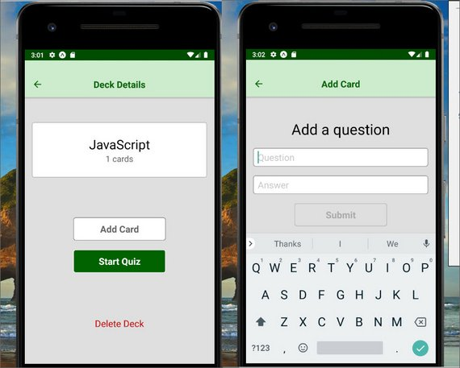](assets/images/mfc26.jpg)<br>
<span class="center bold">Add Card Input Screen</span>

[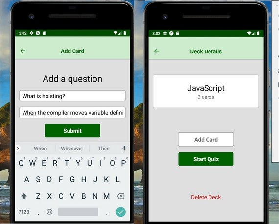](assets/images/mfc27.jpg)<br>
<span class="center bold">Card Added to Deck</span>

```jsx
// Card.js
import React, { Component } from 'react';
import PropTypes from 'prop-types';
import { Text, View, TextInput, StyleSheet } from 'react-native';
import TouchButton from './TouchButton';
import { gray, green } from '../utils/colors';
import { connect } from 'react-redux';
import { addCardToDeck } from '../actions/index';

export class AddCard extends Component {
  static propTypes = {
    navigation: PropTypes.object.isRequired,
    title: PropTypes.string.isRequired,
    addCardToDeck: PropTypes.func.isRequired
  };
  state = {
    question: '',
    answer: ''
  };
  handleQuestionChange = question => {
    this.setState({ question });
  };
  handleAnswerChange = answer => {
    this.setState({ answer });
  };
  handleSubmit = () => {
    const { addCardToDeck, title, navigation } = this.props;
    const card = {
      question: this.state.question,
      answer: this.state.answer
    };

    addCardToDeck(title, card);
    this.setState({ question: '', answer: '' });
    navigation.goBack();
  };
  render() {
    return (
      <View style={styles.container}>
        <View>
          <View style={styles.block}>
            <Text style={styles.title}>Add a question</Text>
          </View>
          <View style={[styles.block]}>
            <TextInput
              style={styles.input}
              value={this.state.question}
              onChangeText={this.handleQuestionChange}
              placeholder="Question"
            />
          </View>
          <View style={[styles.block]}>
            <TextInput
              style={styles.input}
              value={this.state.answer}
              onChangeText={this.handleAnswerChange}
              placeholder="Answer"
            />
          </View>
          <TouchButton
            btnStyle={{ backgroundColor: green, borderColor: '#fff' }}
            onPress={this.handleSubmit}
            disabled={this.state.question === '' || this.state.answer === ''}
          >
            Submit
          </TouchButton>
        </View>
        <View style={{ height: '30%' }} />
      </View>
    );
  }
}

const styles = StyleSheet.create({
  container: {
    flex: 1,
    paddingTop: 16,
    paddingLeft: 16,
    paddingRight: 16,
    paddingBottom: 16,
    backgroundColor: gray,
    justifyContent: 'space-around'
  },
  block: {
    marginBottom: 20
  },
  title: {
    textAlign: 'center',
    fontSize: 32
  },
  input: {
    borderWidth: 1,
    borderColor: 'gray',
    backgroundColor: '#fff',
    paddingLeft: 10,
    paddingRight: 10,
    borderRadius: 5,
    fontSize: 20,
    height: 40
  }
});

const mapStateToProps = (state, { navigation }) => {
  const title = navigation.getParam('title', 'undefined');

  return {
    title
  };
};

export default connect(
  mapStateToProps,
  { addCardToDeck }
)(AddCard);
```

### 5.4 Quiz - Android

[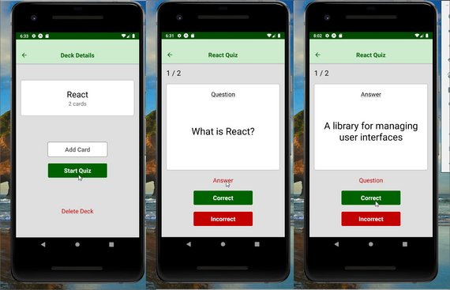](assets/images/mfc28.jpg)<br>
<span class="center bold">Quiz Question #1</span>

[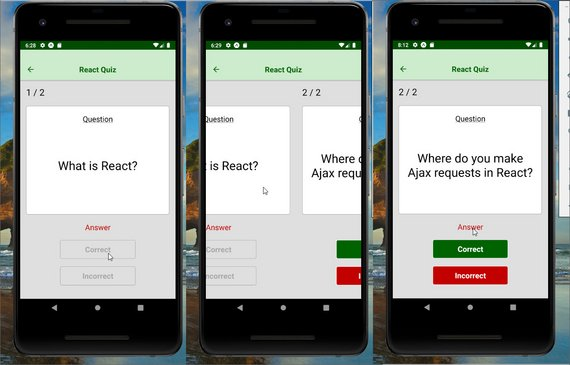](assets/images/mfc29.jpg)<br>
<span class="center bold">Quiz Question #2</span>

[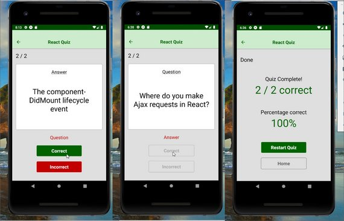](assets/images/mfc30.jpg)<br>
<span class="center bold">Quiz Results</span>

```jsx
// Quiz.js
import React, { Component } from 'react';
import PropTypes from 'prop-types';
import { View, Text, StyleSheet, ViewPagerAndroid } from 'react-native';
import TextButton from './TextButton';
import TouchButton from './TouchButton';
import { gray, green, red, textGray, darkGray, white } from '../utils/colors';
import { connect } from 'react-redux';

const screen = {
  QUESTION: 'question',
  ANSWER: 'answer',
  RESULT: 'result'
};
const answer = {
  CORRECT: 'correct',
  INCORRECT: 'incorrect'
};

export class Quiz extends Component {
  static propTypes = {
    navigation: PropTypes.object.isRequired,
    deck: PropTypes.object.isRequired
  };
  state = {
    show: screen.QUESTION,
    correct: 0,
    incorrect: 0,
    questionCount: this.props.deck.questions.length,
    answered: Array(this.props.deck.questions.length).fill(0)
  };
  handlePageChange = evt => {
    this.setState({
      show: screen.QUESTION
    });
  };
  handleAnswer = (response, page) => {
    if (response === answer.CORRECT) {
      this.setState(prevState => ({ correct: prevState.correct + 1 }));
    } else {
      this.setState(prevState => ({ incorrect: prevState.incorrect + 1 }));
    }
    this.setState(
      prevState => ({
        answered: prevState.answered.map((val, idx) => (page === idx ? 1 : val))
      }),
      () => {
        const { correct, incorrect, questionCount } = this.state;

        if (questionCount === correct + incorrect) {
          this.setState({ show: screen.RESULT });
        } else {
          this.viewPager.setPage(page + 1);
          this.setState(prevState => ({
            show: screen.QUESTION
          }));
        }
      }
    );
  };
  handleReset = () => {
    this.setState(prevState => ({
      show: screen.QUESTION,
      correct: 0,
      incorrect: 0,
      answered: Array(prevState.questionCount).fill(0)
    }));
  };
  render() {
    const { questions } = this.props.deck;
    const { show } = this.state;

    if (this.state.show === screen.RESULT) {
      const { correct, questionCount } = this.state;
      const percent = ((correct / questionCount) * 100).toFixed(0);
      const resultStyle =
        percent >= 70 ? styles.resultTextGood : styles.resultTextBad;

      return (
        <View style={styles.pageStyle}>
          <View style={styles.block}>
            <Text style={styles.count}>Done</Text>
          </View>
          <View style={styles.block}>
            <Text style={[styles.count, { textAlign: 'center' }]}>
              Quiz Complete!
            </Text>
            <Text style={resultStyle}>
              {correct} / {questionCount} correct
            </Text>
          </View>
          <View style={styles.block}>
            <Text style={[styles.count, { textAlign: 'center' }]}>
              Percentage correct
            </Text>
            <Text style={resultStyle}>{percent}%</Text>
          </View>
          <View>
            <TouchButton
              btnStyle={{ backgroundColor: green, borderColor: white }}
              onPress={this.handleReset}
            >
              Restart Quiz
            </TouchButton>
            <TouchButton
              btnStyle={{ backgroundColor: gray, borderColor: textGray }}
              txtStyle={{ color: textGray }}
              onPress={() => {
                this.handleReset();
                this.props.navigation.navigate('Home');
              }}
            >
              Home
            </TouchButton>
          </View>
        </View>
      );
    }

    return (
      <ViewPagerAndroid
        style={styles.container}
        scrollEnabled={true}
        onPageSelected={this.handlePageChange}
        ref={viewPager => {
          this.viewPager = viewPager;
        }}
      >
        {questions.map((question, idx) => (
          <View style={styles.pageStyle} key={idx}>
            <View style={styles.block}>
              <Text style={styles.count}>
                {idx + 1} / {questions.length}
              </Text>
            </View>
            <View style={[styles.block, styles.questionContainer]}>
              <Text style={styles.questionText}>
                {show === screen.QUESTION ? 'Question' : 'Answer'}
              </Text>
              <View style={styles.questionWrapper}>
                <Text style={styles.title}>
                  {show === screen.QUESTION
                    ? question.question
                    : question.answer}
                </Text>
              </View>
            </View>
            {show === screen.QUESTION ? (
              <TextButton
                txtStyle={{ color: red }}
                onPress={() => this.setState({ show: screen.ANSWER })}
              >
                Answer
              </TextButton>
            ) : (
              <TextButton
                txtStyle={{ color: red }}
                onPress={() => this.setState({ show: screen.QUESTION })}
              >
                Question
              </TextButton>
            )}
            <View>
              <TouchButton
                btnStyle={{ backgroundColor: green, borderColor: white }}
                onPress={() => this.handleAnswer(answer.CORRECT, idx)}
                disabled={this.state.answered[idx] === 1}
              >
                Correct
              </TouchButton>
              <TouchButton
                btnStyle={{ backgroundColor: red, borderColor: white }}
                onPress={() => this.handleAnswer(answer.INCORRECT, idx)}
                disabled={this.state.answered[idx] === 1}
              >
                Incorrect
              </TouchButton>
            </View>
          </View>
        ))}
      </ViewPagerAndroid>
    );
  }
}

const styles = StyleSheet.create({
  container: {
    flex: 1
  },
  pageStyle: {
    flex: 1,
    paddingTop: 16,
    paddingLeft: 16,
    paddingRight: 16,
    paddingBottom: 16,
    backgroundColor: gray,
    justifyContent: 'space-around'
  },
  block: {
    marginBottom: 20
  },
  count: {
    fontSize: 24
  },
  title: {
    fontSize: 32,
    textAlign: 'center'
  },
  questionContainer: {
    borderWidth: 1,
    borderColor: darkGray,
    backgroundColor: white,
    borderRadius: 5,
    paddingTop: 20,
    paddingBottom: 20,
    paddingLeft: 16,
    paddingRight: 16,
    flexGrow: 1
  },
  questionWrapper: {
    flex: 1,
    justifyContent: 'center'
  },
  questionText: {
    textDecorationLine: 'underline',
    textAlign: 'center',
    fontSize: 20
  },
  resultTextGood: {
    color: green,
    fontSize: 46,
    textAlign: 'center'
  },
  resultTextBad: {
    color: red,
    fontSize: 46,
    textAlign: 'center'
  }
});

const mapStateToProps = (state, { title }) => {
  const deck = state[title];

  return {
    deck
  };
};

export default withNavigation(connect(mapStateToProps)(Quiz_Android));
```

### 5.5 Quiz - iOS

[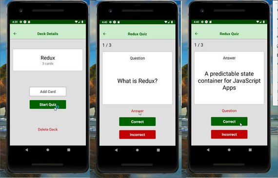](assets/images/mfc31.jpg)<br>
<span class="center bold">Quiz Question #1</span>

[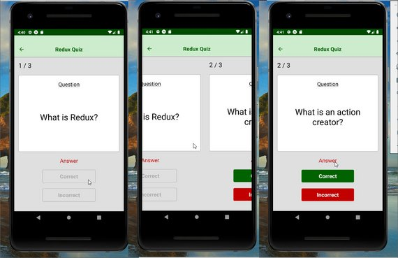](assets/images/mfc32.jpg)<br>
<span class="center bold">Quiz Question #2</span>

[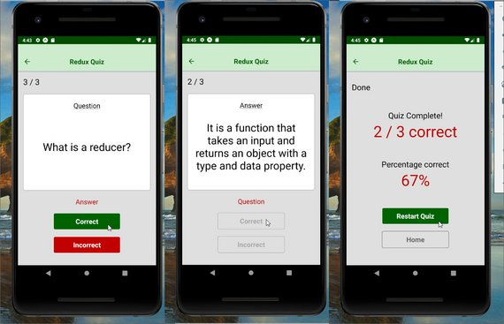](assets/images/mfc33.jpg)<br>
<span class="center bold">Quiz Result</span>

```jsx
// Quiz_iOS.js
import React, { Component } from 'react';
import PropTypes from 'prop-types';
import { View, Text, StyleSheet, ScrollView, Dimensions } from 'react-native';
import TextButton from './TextButton';
import TouchButton from './TouchButton';
import { gray, green, red, textGray, darkGray, white } from '../utils/colors';
import { connect } from 'react-redux';
import { withNavigation } from 'react-navigation';

const screen = {
  QUESTION: 'question',
  ANSWER: 'answer',
  RESULT: 'result'
};
const answer = {
  CORRECT: 'correct',
  INCORRECT: 'incorrect'
};
const SCREEN_WIDTH = Dimensions.get('window').width;

class Quiz_iOS extends Component {
  static propTypes = {
    navigation: PropTypes.object.isRequired,
    deck: PropTypes.object.isRequired
  };
  state = {
    show: screen.QUESTION,
    correct: 0,
    incorrect: 0,
    questionCount: this.props.deck.questions.length,
    answered: Array(this.props.deck.questions.length).fill(0)
  };
  handleScroll = () => {
    this.setState({
      show: screen.QUESTION
    });
  };
  handleAnswer = (response, page) => {
    if (response === answer.CORRECT) {
      this.setState(prevState => ({ correct: prevState.correct + 1 }));
    } else {
      this.setState(prevState => ({ incorrect: prevState.incorrect + 1 }));
    }
    this.setState(
      prevState => ({
        answered: prevState.answered.map((val, idx) => (page === idx ? 1 : val))
      }),
      () => {
        const { correct, incorrect, questionCount } = this.state;

        if (questionCount === correct + incorrect) {
          this.setState({ show: screen.RESULT });
        } else {
          this.scrollView.scrollTo({ x: (page + 1) * SCREEN_WIDTH });
          this.setState(prevState => ({
            show: screen.QUESTION
          }));
        }
      }
    );
  };
  handleReset = () => {
    this.setState(prevState => ({
      show: screen.QUESTION,
      correct: 0,
      incorrect: 0,
      answered: Array(prevState.questionCount).fill(0)
    }));
  };
  render() {
    const { questions } = this.props.deck;
    const { show } = this.state;

    if (this.state.show === screen.RESULT) {
      const { correct, questionCount } = this.state;
      const percent = ((correct / questionCount) * 100).toFixed(0);
      const resultStyle =
        percent >= 70 ? styles.resultTextGood : styles.resultTextBad;

      return (
        <View style={styles.pageStyle}>
          <View style={styles.block}>
            <Text style={styles.count}>Done</Text>
          </View>
          <View style={styles.block}>
            <Text style={[styles.count, { textAlign: 'center' }]}>
              Quiz Complete!
            </Text>
            <Text style={resultStyle}>
              {correct} / {questionCount} correct
            </Text>
          </View>
          <View style={styles.block}>
            <Text style={[styles.count, { textAlign: 'center' }]}>
              Percentage correct
            </Text>
            <Text style={resultStyle}>{percent}%</Text>
          </View>
          <View>
            <TouchButton
              btnStyle={{ backgroundColor: green, borderColor: white }}
              onPress={this.handleReset}
            >
              Restart Quiz
            </TouchButton>
            <TouchButton
              btnStyle={{ backgroundColor: gray, borderColor: textGray }}
              txtStyle={{ color: textGray }}
              onPress={() => {
                this.handleReset();
                this.props.navigation.navigate('Home');
              }}
            >
              Home
            </TouchButton>
          </View>
        </View>
      );
    }

    return (
      <ScrollView
        style={styles.container}
        pagingEnabled={true}
        horizontal={true}
        onMomentumScrollBegin={this.handleScroll}
        ref={scrollView => {
          this.scrollView = scrollView;
        }}
      >
        {questions.map((question, idx) => (
          <View style={styles.pageStyle} key={idx}>
            <View style={styles.block}>
              <Text style={styles.count}>
                {idx + 1} / {questions.length}
              </Text>
            </View>
            <View style={[styles.block, styles.questionContainer]}>
              <Text style={styles.questionText}>
                {show === screen.QUESTION ? 'Question' : 'Answer'}
              </Text>
              <View style={styles.questionWrapper}>
                <Text style={styles.title}>
                  {show === screen.QUESTION
                    ? question.question
                    : question.answer}
                </Text>
              </View>
            </View>
            {show === screen.QUESTION ? (
              <TextButton
                txtStyle={{ color: red }}
                onPress={() => this.setState({ show: screen.ANSWER })}
              >
                Answer
              </TextButton>
            ) : (
              <TextButton
                txtStyle={{ color: red }}
                onPress={() => this.setState({ show: screen.QUESTION })}
              >
                Question
              </TextButton>
            )}
            <View>
              <TouchButton
                btnStyle={{ backgroundColor: green, borderColor: white }}
                onPress={() => this.handleAnswer(answer.CORRECT, idx)}
                disabled={this.state.answered[idx] === 1}
              >
                Correct
              </TouchButton>
              <TouchButton
                btnStyle={{ backgroundColor: red, borderColor: white }}
                onPress={() => this.handleAnswer(answer.INCORRECT, idx)}
                disabled={this.state.answered[idx] === 1}
              >
                Incorrect
              </TouchButton>
            </View>
          </View>
        ))}
      </ScrollView>
    );
  }
}

const styles = StyleSheet.create({
  container: {
    flex: 1
  },
  pageStyle: {
    flex: 1,
    paddingTop: 16,
    paddingLeft: 16,
    paddingRight: 16,
    paddingBottom: 16,
    backgroundColor: gray,
    justifyContent: 'space-around',
    width: SCREEN_WIDTH
  },
  block: {
    marginBottom: 20
  },
  count: {
    fontSize: 24
  },
  title: {
    fontSize: 32,
    textAlign: 'center'
  },
  questionContainer: {
    borderWidth: 1,
    borderColor: darkGray,
    backgroundColor: white,
    borderRadius: 5,
    paddingTop: 20,
    paddingBottom: 20,
    paddingLeft: 16,
    paddingRight: 16,
    flexGrow: 1
  },
  questionWrapper: {
    flex: 1,
    justifyContent: 'center'
  },
  questionText: {
    textDecorationLine: 'underline',
    textAlign: 'center',
    fontSize: 20
  },
  resultTextGood: {
    color: green,
    fontSize: 46,
    textAlign: 'center'
  },
  resultTextBad: {
    color: red,
    fontSize: 46,
    textAlign: 'center'
  }
});

const mapStateToProps = (state, { title }) => {
  const deck = state[title];

  return {
    deck
  };
};

export default withNavigation(connect(mapStateToProps)(Quiz_iOS));
```

### 5.6 Quiz Wrapper

```jsx
// Quiz.js
import React, { Component } from 'react';
import PropTypes from 'prop-types';
import { Constants } from 'expo';
import Quiz_Android from './Quiz_Android';
import Quiz_iOS from './Quiz_iOS';

export class Quiz extends Component {
  static propTypes = {
    navigation: PropTypes.object.isRequired
  };
  static navigationOptions = ({ navigation }) => {
    const title = navigation.getParam('title', '');
    return {
      title: `${title} Quiz`
    };
  };
  render() {
    const { navigation } = this.props;
    const title = navigation.getParam('title', '');

    if (Constants.platform.android) {
      return <Quiz_Android title={title} />;
    }
    return <Quiz_iOS title={title} />;
  }
}

export default Quiz;
```


<!-- ### 4.5 Settings Tab
A settings tab has been added that allows AsyncStorage to be reset back to the original data set.

[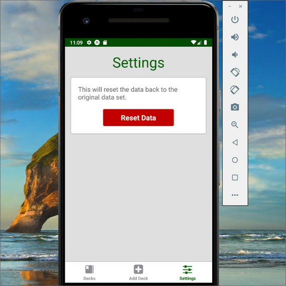](assets/images/mfc20.jpg)<br>
<span class="center bold">Settings Tab</span> -->
